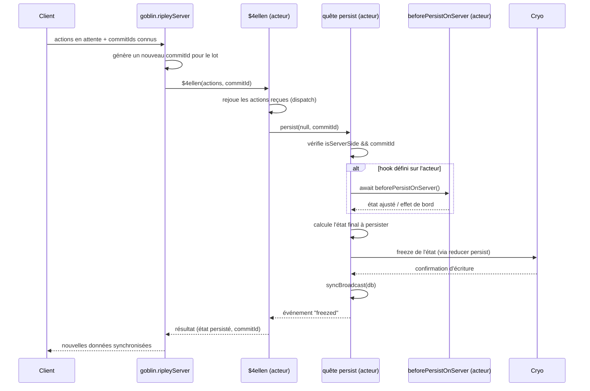

# Synchronisation

## Aperçu

Le hook `beforePersistOnServer` est un point d'extension optionnel que peut implémenter un acteur **Elf** de type `Archetype` (c'est-à-dire un acteur dont l'état est persisté via Cryo). Il est invoqué automatiquement par la quête générique `persist` juste avant l'écriture définitive de l'état d'un acteur dans la base Cryo, mais uniquement dans un contexte bien précis : lorsque le serveur applique un lot d'actions reçu d'un client dans le cadre de la synchronisation des actions (`actionsSync`). Il permet d'injecter ou de corriger, côté serveur uniquement, des informations que le client ne peut pas connaître ou n'est pas autorisé à définir lui-même.

## Fonctionnement

### Rôle du hook

Chaque acteur `Elf.Archetype` bénéficie d'une quête `persist` générée automatiquement par le framework lors de sa configuration (voir `Elf.configure` dans `lib/elf/index.js`). Cette quête est responsable de figer (« freeze ») l'état courant de l'acteur dans Cryo. `beforePersistOnServer` est une méthode facultative que l'auteur d'un acteur peut définir sur sa classe Elf ; si elle existe, elle est appelée juste avant que l'état ne soit calculé et transmis au reducer `persist`. Cela permet, par exemple, de recalculer un champ dérivé, d'appliquer une validation, ou d'injecter une donnée que seul le serveur maître possède (horodatage serveur, identifiant contrôlé, etc.), sans que le client puisse l'altérer.

### Conditions de déclenchement

Le hook n'est pas appelé à chaque persist. Deux conditions doivent être réunies simultanément dans la quête `persist` :

- **Le nœud courant est côté serveur** : cela correspond à `isServerSide`, qui vaut `true` dès que la synchronisation des actions n'est pas activée en tant que client sur ce nœud (`actionsSync.enable` est faux ou absent).
- **Un `commitId` est déjà fourni en paramètre** de la quête `persist`.

En pratique, un `commitId` n'est transmis à `persist` que dans un seul scénario : lorsque le serveur rejoue les actions reçues d'un client via la quête interne `$4ellen` (déclenchée par `goblin.ripleyServer` pendant une synchronisation). Dans ce cas, un nouveau `commitId` est généré pour le lot d'actions du client, puis la quête `$4ellen` appelle explicitement `persist(null, commitId)` sur l'acteur concerné.

À l'inverse, une mutation locale ordinaire (un acteur qui fait `this.persist()` suite à sa propre logique métier, sans synchronisation en cours) n'a pas de `commitId` en entrée : dans ce cas, si le nœud est serveur, un nouveau `commitId` est généré _après_ le point où le hook est vérifié, donc `beforePersistOnServer` n'est pas appelé pour ce type de persist local.

Il existe également, dans la même quête `persist`, une vérification distincte visant à éviter un effet de rebond : si la synchronisation client est activée (`syncClientEnabled`) et qu'un `commitId` et une base (`db`) sont fournis, la quête consulte le statut Cryo de l'entité (`commitStatus`) ; si une action plus récente est déjà en attente localement (« staged »), la persistance est ignorée. Cette vérification concerne le scénario où c'est le **client** qui applique une action persistée reçue du serveur (voir `_ripleyApplyPersisted`) ; elle est mutuellement exclusive avec l'appel du hook, puisque ce dernier ne se produit que côté serveur (`isServerSide`), soit précisément lorsque la synchronisation client n'est pas active sur ce nœud.

### Étapes d'exécution

1. Un client synchronise sa base d'actions via `goblin.ripleyClient`, ce qui envoie ses actions en attente au serveur (`goblin.ripleyServer`).
2. Le serveur regroupe les actions reçues par acteur concerné et, pour chacun, recrée temporairement l'instance sur un desktop système (`system@ripley`).
3. Pour chaque acteur, le serveur appelle sa quête interne `$4ellen` avec le lot d'actions du client et un `commitId` nouvellement généré pour ce lot.
4. `$4ellen` rejoue chaque action reçue (hors `create` si l'entité existe déjà), puis appelle `persist(null, commitId)` sur l'acteur.
5. La quête `persist` générique s'exécute, côté serveur :
   - comme `isServerSide` est vrai et qu'un `commitId` est présent, elle appelle `quest.me.beforePersistOnServer()` si cette méthode est définie sur l'acteur ;
   - l'état à persister est ensuite déterminé (état courant de l'acteur, éventuellement déjà modifié par le hook) ;
   - l'état est propagé au reducer `persist` via `quest.do(...)`, ce qui déclenche la sauvegarde effective dans Cryo (via le middleware de persistance Ripley) ;
   - une diffusion (`syncBroadcast`) est faite pour notifier les autres clients qu'une nouvelle donnée est disponible.
6. `$4ellen` attend la confirmation que l'action a bien été figée (événement `<goblin-commitId-freezed>`) avant de retourner le résultat au client.

### Diagramme de séquence

### Limitation connue

Le hook n'est appelé que via le chemin standard de la quête `persist` des acteurs **Elf**. Il existe, dans le module, un second chemin de persistance destiné aux acteurs **Goblin** classiques (legacy), utilisé par les quêtes `insertOrCreate` et `insertOrReplace` (fonction interne `#insertQuest` dans `lib/index.js`). Ce chemin alternatif ne fait actuellement pas appel à `beforePersistOnServer` : le code source contient d'ailleurs un commentaire explicite signalant ce manque (« nous devons appeler le hook before persist, mais comment ? »). Le hook doit donc être considéré comme spécifique aux acteurs Elf passant par la quête `persist` générique, et non comme un mécanisme garanti pour tous les chemins d'insertion/persistance du framework.

---

_Mise à jour de la documentation existante : précision apportée sur la mutuelle exclusivité entre la vérification anti-rebond côté client (« staged ») et l'appel du hook côté serveur, ainsi que sur l'appel à `syncBroadcast` suivant la persistance._
