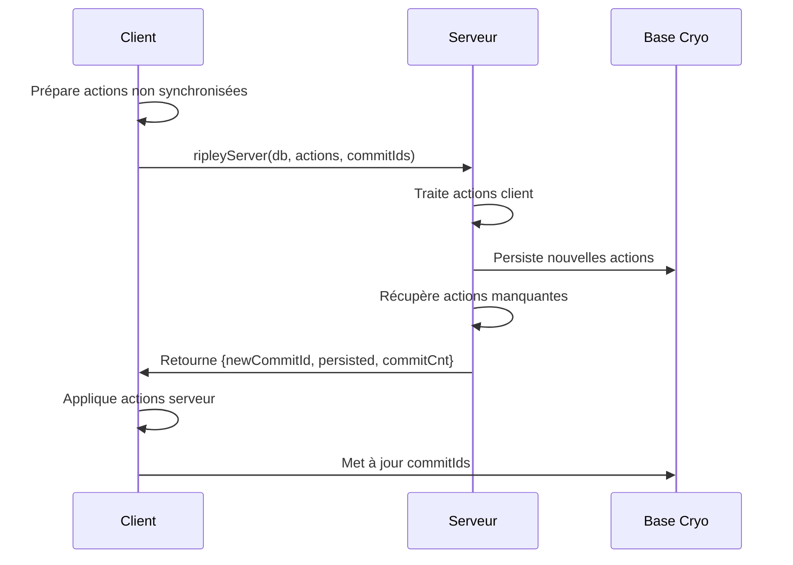
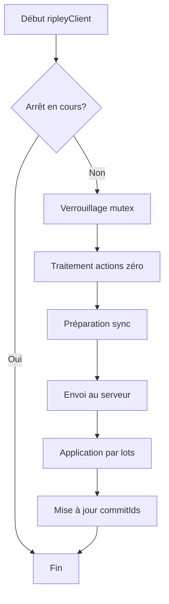
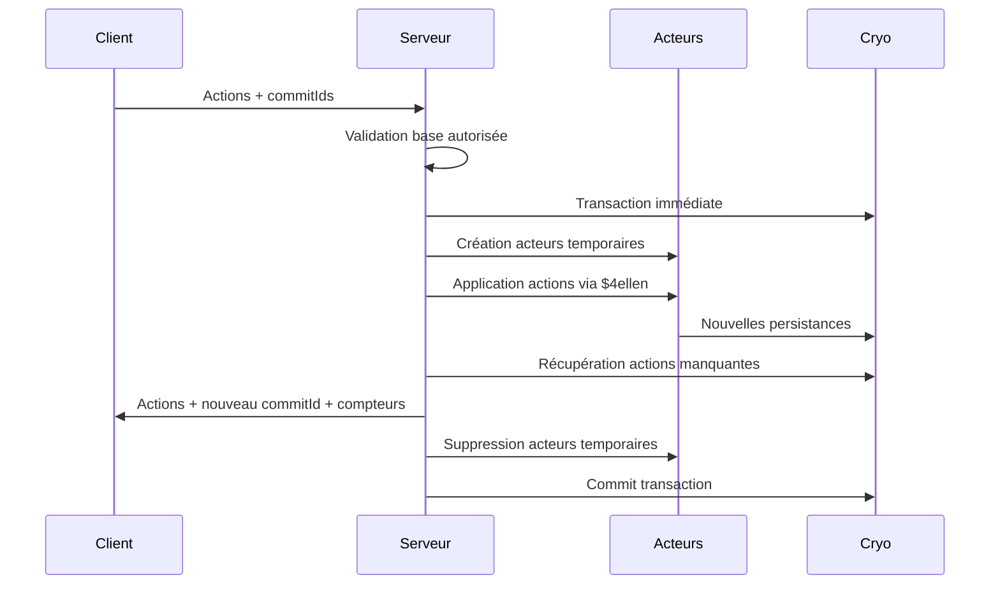
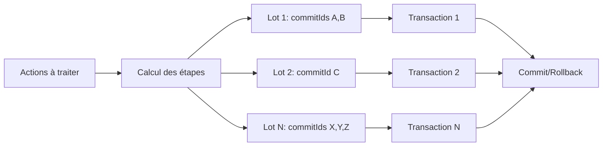
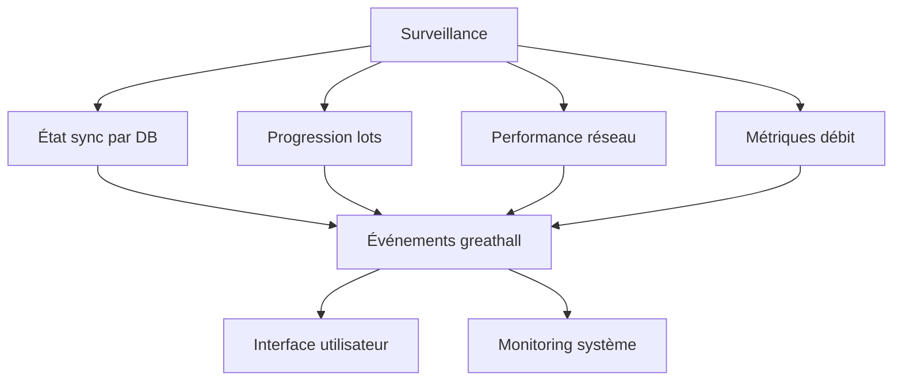
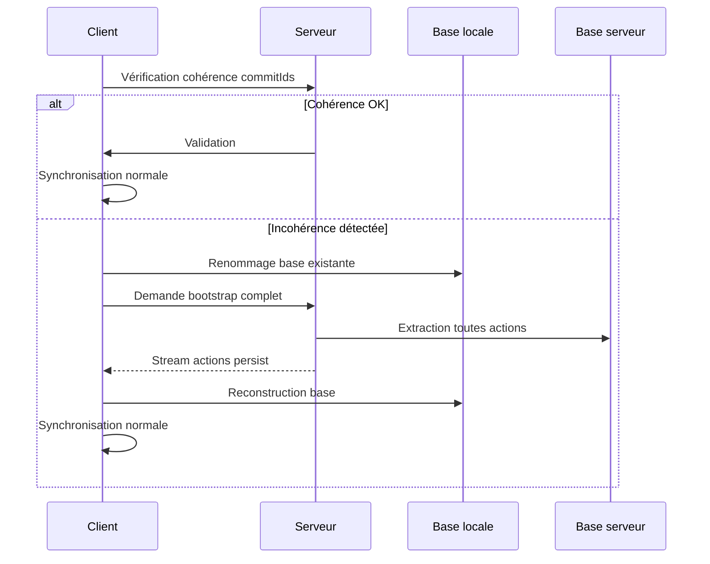

# Synchronisation

## Aperçu

Le système de synchronisation Ripley permet la réplication des données entre un serveur et des clients dans l'écosystème Xcraft. Il assure la cohérence des états des acteurs Goblin en synchronisant les actions persistées dans les bases de données Cryo. Le mécanisme fonctionne de manière bidirectionnelle : les clients envoient leurs actions non synchronisées au serveur, qui les traite et renvoie les actions manquantes pour maintenir la cohérence globale.

## Sommaire

- [Architecture générale](#architecture-générale)
- [Synchronisation côté client](#synchronisation-côté-client)
- [Synchronisation côté serveur](#synchronisation-côté-serveur)
- [Gestion des commits](#gestion-des-commits)
- [Traitement par lots](#traitement-par-lots)
- [Gestion des erreurs et récupération](#gestion-des-erreurs-et-récupération)
- [Surveillance et performance](#surveillance-et-performance)
- [Bootstrap et initialisation](#bootstrap-et-initialisation)

## Architecture générale

Le système Ripley repose sur deux quêtes principales :

- **`ripleyClient`** : Gère la synchronisation côté client
- **`ripleyServer`** : Traite les demandes de synchronisation côté serveur

La synchronisation s'appuie sur les bases de données Cryo qui stockent les actions des acteurs sous forme d'événements. Chaque action possède un `commitId` unique qui permet de maintenir l'ordre et la cohérence des modifications.

## Synchronisation côté client

### Préparation des données

La quête `_ripleyPrepareSync` prépare les données pour la synchronisation :

1. **Verrouillage de la base** : Utilise une transaction immédiate pour éviter les conflits
2. **Récupération des actions** : Extrait les actions non synchronisées depuis le dernier commit via `getDataForSync`
3. **Marquage temporaire** : Assigne un commitId zéro aux actions en cours de synchronisation pour éviter leur renvoi en cas d'interruption

### Processus de synchronisation

La quête `ripleyClient` orchestre le processus complet :

1. **Vérification préalable** : S'assure que la synchronisation n'est pas en cours d'arrêt via le flag `ripley.shuttingDown`
2. **Gestion des actions zéro** : Traite les actions interrompues lors d'une synchronisation précédente en vérifiant leur existence côté serveur
3. **Envoi au serveur** : Transmet les actions et commitIds au serveur via `ripleyServer`
4. **Application des réponses** : Traite les actions retournées par le serveur par lots via `_ripleyApplyPersisted`

Le client maintient un verrou par base de données pour éviter les synchronisations concurrentes et utilise un système de compteurs (`ripley.thinking`) pour empêcher l'arrêt pendant une synchronisation active.

## Synchronisation côté serveur

### Traitement des actions client

La quête `ripleyServer` traite les demandes de synchronisation :

1. **Validation** : Vérifie que la base de données est autorisée dans la liste des bases synchronisables (`dbSyncList`)
2. **Verrouillage transactionnel** : Utilise une transaction immédiate Cryo pour garantir la cohérence
3. **Création d'acteurs temporaires** : Instancie les acteurs nécessaires dans le feed système `system@ripley`
4. **Application des actions** : Exécute les actions client via la quête `$4ellen` qui rejoue les actions et génère de nouvelles persistances
5. **Génération de nouvelles persistances** : Crée de nouvelles actions persist avec un commitId serveur unique

### Récupération des actions manquantes

Le serveur identifie et retourne les actions que le client n'a pas encore reçues :

1. **Détermination de la plage** : Calcule l'intervalle entre le dernier commit client connu et le dernier commit serveur
2. **Extraction des actions** : Récupère les actions persist dans cette plage via `getPersistFromRange`
3. **Préservation de l'ordre** : Maintient l'ordre chronologique des commits pour garantir la cohérence, avec les nouvelles actions du client placées en fin de séquence

## Gestion des commits

### Système de commitId

Chaque action possède un `commitId` unique (UUID v4) qui permet :

- **Traçabilité** : Identifier l'origine et l'ordre des modifications
- **Cohérence** : Garantir que toutes les actions d'un même commit sont traitées ensemble
- **Récupération** : Reprendre une synchronisation interrompue au bon endroit
- **Déduplication** : Éviter le traitement multiple des mêmes actions

### États des commits

Les actions peuvent avoir différents états de commit :

- **NULL** : Actions locales non synchronisées
- **Zéro (UUID zéro)** : Actions en cours de synchronisation (marquage temporaire via `prepareDataForSync`)
- **UUID valide** : Actions synchronisées avec succès

### Vérification de cohérence

Le système vérifie la cohérence des commits entre client et serveur via `ripleyCheckForCommitId` pour s'assurer que les bases de données sont compatibles avant la synchronisation. Si aucun commitId client n'est reconnu par le serveur, cela indique une incompatibilité nécessitant un bootstrap complet.

## Traitement par lots

### Calcul des étapes

La fonction `computeRipleySteps` détermine comment grouper les actions pour le traitement par lots, en respectant la contrainte critique que toutes les actions d'un même commitId doivent être dans le même lot. Cette fonction prend en compte :

- **Limite par lot** : Nombre maximum d'actions par étape (défaut : 20)
- **Intégrité des commits** : Aucun commitId ne peut être divisé entre plusieurs lots
- **Optimisation** : Maximise le nombre d'actions par lot tout en respectant les contraintes
- **Compatibilité** : Gère les anciens serveurs qui ne fournissent pas de compteurs de commits

### Application séquentielle

Les actions sont appliquées par lots pour :

- **Performance** : Éviter de surcharger la base de données avec trop d'opérations simultanées
- **Cohérence** : Maintenir l'intégrité transactionnelle par lot via les transactions Cryo
- **Récupération** : Permettre l'arrêt et la reprise de la synchronisation entre les lots
- **Monitoring** : Fournir des indicateurs de progression précis via les événements de performance

## Gestion des erreurs et récupération

### Mécanismes de récupération

- **Actions zéro** : Les actions avec commitId zéro sont détectées au démarrage via `getZeroActions` et retraitées ou nettoyées selon leur état sur le serveur
- **Rollback transactionnel** : En cas d'erreur, les transactions Cryo sont annulées automatiquement
- **Retry automatique** : Les synchronisations échouées sont relancées automatiquement par le système de debounce
- **Restauration d'état** : Les commitIds zéro sont restaurés à NULL en cas d'échec via `prepareDataForSync` pour permettre une nouvelle tentative

### Gestion de l'arrêt

La quête `tryShutdown` permet un arrêt propre du système :

1. **Signalement** : Marque le système comme en cours d'arrêt via le flag `ripley.shuttingDown`
2. **Attente conditionnelle** : Attend la fin des synchronisations en cours si demandé en surveillant `ripley.thinking`
3. **Rapport d'état** : Indique les bases de données encore en cours de traitement
4. **Timeout** : Limite l'attente pour éviter un blocage indéfini (vérification toutes les secondes)

## Surveillance et performance

### Indicateurs de synchronisation

Le système fournit des indicateurs de progression via les événements `greathall::<perf>` :

- **État de synchronisation** : Actif/inactif par base de données avec indicateur de progression
- **Progression détaillée** : Position actuelle et nombre total d'actions dans le traitement des lots
- **Performance réseau** : Temps de traitement et détection des déconnexions/latences via HordesSync
- **Métriques de débit** : Temps de traitement par lot avec logging détaillé

### Optimisations

- **Traitement parallèle** : Plusieurs bases peuvent se synchroniser simultanément (limite de 4 par défaut dans HordesSync)
- **Lots adaptatifs** : La taille des lots s'adapte au contenu et aux contraintes de commitId
- **Cache intelligent** : Réutilisation des connexions Cryo et des requêtes préparées
- **Debounce intelligent** : Évite les synchronisations trop fréquentes (500ms de délai)
- **Surveillance réseau** : Détection automatique des déconnexions et adaptation du comportement
- **Seuil de reporting** : Les synchronisations de moins d'1 seconde ne sont pas reportées pour éviter le spam

## Bootstrap et initialisation

### Processus de bootstrap

Le système HordesSync gère l'initialisation et le bootstrap des bases de données :

1. **Vérification d'existence** : Contrôle si la base de données existe et si elle est vide via `cryo.isEmpty`
2. **Validation de cohérence** : Vérifie que les commitIds locaux sont connus du serveur via `ripleyCheckBeforeSync`
3. **Bootstrap automatique** : En cas d'incohérence, récupère toutes les actions persist du serveur via `cryo.getAllPersist`
4. **Renommage de sauvegarde** : Sauvegarde l'ancienne base avant le bootstrap si nécessaire via `cryo.bootstrapActions`

### Gestion des connexions

Le système surveille la connectivité réseau et adapte son comportement :

- **Détection de déconnexion** : Monitoring des sockets et de la latence réseau via les événements `greathall::<perf>`
- **Récupération automatique** : Relance la synchronisation lors du retour de connectivité
- **Gestion du lag** : Annulation des commandes en cours en cas de latence excessive (>30s) via `Command.abortAll`
- **Bootstrap conditionnel** : Initialisation différée jusqu'à la disponibilité du réseau
- **Exclusion de bases** : Respect de la configuration `actionsSync.excludeDB` pour ignorer certaines bases

---

_Ce document a été mis à jour pour refléter l'implémentation actuelle du système de synchronisation Ripley._