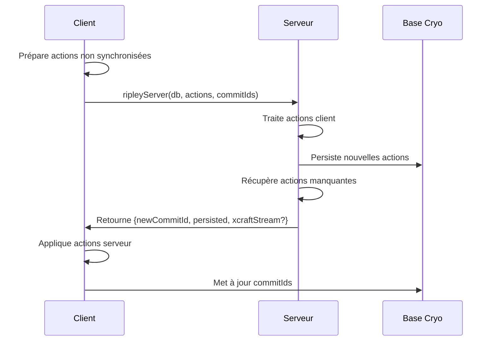
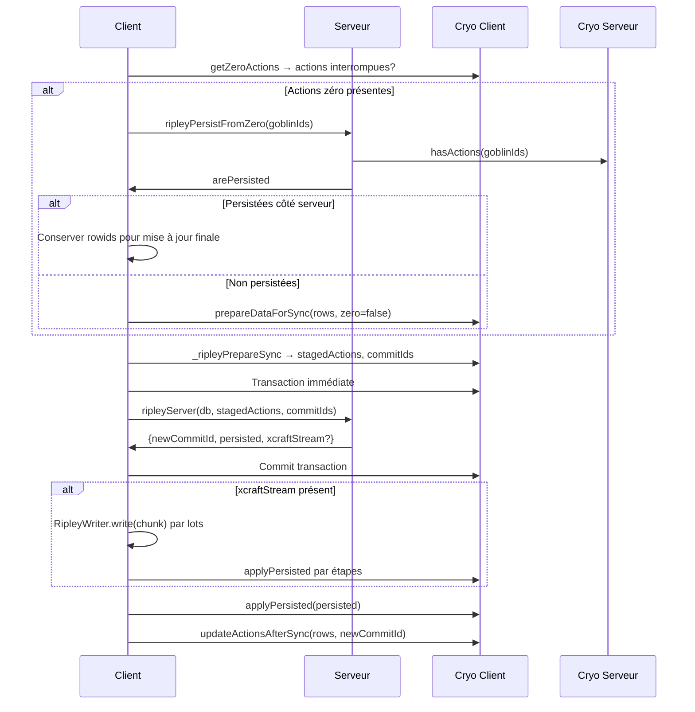
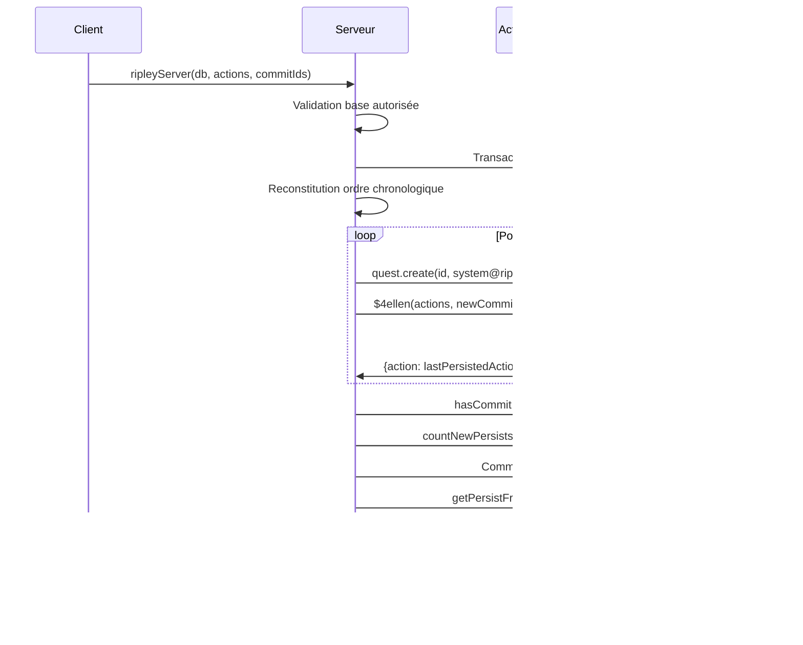
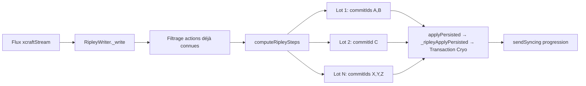
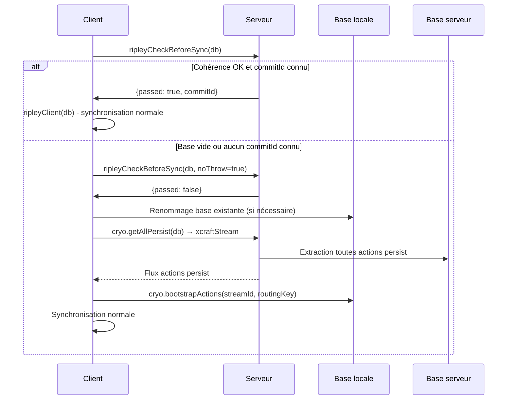

# Synchronisation

## Aperçu

Le système de synchronisation Ripley permet la réplication des données entre un serveur et des clients dans l'écosystème Xcraft. Il assure la cohérence des états des acteurs Goblin/Elf en synchronisant les actions persistées dans les bases de données Cryo. Le mécanisme fonctionne de manière bidirectionnelle : les clients envoient leurs actions non synchronisées au serveur, qui les applique, les persiste avec un nouveau commit, puis renvoie au client toutes les actions manquantes pour maintenir la cohérence globale.

## Sommaire

- [Architecture générale](#architecture-générale)
- [Synchronisation côté client](#synchronisation-côté-client)
- [Synchronisation côté serveur](#synchronisation-côté-serveur)
- [Application des actions persistées](#application-des-actions-persistées)
- [Gestion des commits](#gestion-des-commits)
- [Traitement par lots](#traitement-par-lots)
- [Gestion des erreurs et récupération](#gestion-des-erreurs-et-récupération)
- [Surveillance et performance](#surveillance-et-performance)
- [Bootstrap et initialisation](#bootstrap-et-initialisation)

## Fonctionnement

### Architecture générale

Le système Ripley repose sur deux quêtes principales dans le fichier `lib/service.js` :

- **`ripleyClient`** : gère la synchronisation côté client.
- **`ripleyServer`** : traite les demandes de synchronisation côté serveur.

Ces deux quêtes ne sont enregistrées que d'un seul côté selon la configuration `actionsSync.isServer` : un nœud serveur expose `ripleyServer` (ainsi que `ripleyPersistFromZero`, `ripleyGetAllPersist` et `ripleyCheckForCommitId`), tandis qu'un nœud client expose `ripleyClient`.

La synchronisation s'appuie sur les bases de données Cryo qui stockent les actions des acteurs sous forme d'événements. Chaque action possède un `commitId` unique qui permet de maintenir l'ordre et la cohérence des modifications.

```mermaid
sequenceDiagram
    participant C as Client
    participant S as Serveur
    participant DB as Base Cryo

    C->>C: Prépare actions non synchronisées
    C->>S: ripleyServer(db, actions, commitIds)
    S->>S: Traite actions client
    S->>DB: Persiste nouvelles actions
    S->>S: Récupère actions manquantes
    S->>C: Retourne {newCommitId, persisted, xcraftStream?}
    C->>C: Applique actions serveur
    C->>DB: Met à jour commitIds
```

### Principe de base

Le système Ripley implémente un mécanisme de synchronisation bidirectionnelle où :

1. **Le client envoie ses modifications** : les actions de réduction (reducers) qui modifient partiellement l'état des acteurs.
2. **Le serveur traite et répond** : il applique ces actions, génère de nouvelles persistances complètes et retourne toutes les actions manquantes.
3. **Le client applique la vérité serveur** : il reçoit et applique les actions `persist` qui contiennent l'état complet des acteurs.

### Cycle de synchronisation

Chaque cycle de synchronisation suit ces étapes :

1. **Préparation client** : extraction des actions non synchronisées et marquage temporaire avec un commitId zéro.
2. **Transmission** : envoi des actions et des derniers commitIds connus au serveur.
3. **Traitement serveur** : application des actions client, génération de nouvelles persistances et récupération des actions manquantes.
4. **Application client** : traitement par lots des actions serveur et mise à jour des commitIds.
5. **Finalisation** : remplacement des commitIds zéro par les commitIds serveur définitifs.

### Synchronisation côté client

#### Préparation des données

La quête `_ripleyPrepareSync` prépare les données pour la synchronisation :

1. **Verrouillage de la base** : utilise une transaction immédiate pour éviter les conflits.
2. **Récupération des actions** : extrait les actions non synchronisées depuis le dernier commit via `getDataForSync`.
3. **Marquage temporaire** : assigne un commitId zéro aux actions en cours de synchronisation pour éviter leur renvoi en cas d'interruption.

#### Processus de synchronisation

La quête `ripleyClient` orchestre le processus complet :

1. **Vérification préalable** : s'assure que la synchronisation n'est pas en cours d'arrêt via le flag `ripley.shuttingDown`.
2. **Verrouillage par base** : acquiert un mutex `ripleyClient-${db}` pour éviter les synchronisations concurrentes sur la même base, et incrémente un compteur `ripley.thinking` qui empêche l'arrêt du système pendant qu'une synchronisation est active.
3. **Gestion des actions zéro** : traite les actions interrompues lors d'une synchronisation précédente en vérifiant leur existence côté serveur via `ripleyPersistFromZero`. Si les actions sont connues du serveur, leurs rowids sont conservés pour une mise à jour ultérieure des commitIds ; sinon, les marqueurs zéro sont effacés (retour à NULL) pour permettre un nouvel envoi.
4. **Envoi au serveur** : transmet les actions et commitIds au serveur via `ripleyServer`, le tout encadré par une transaction immédiate côté client.
5. **Réception d'un flux de données** : si le serveur retourne un `xcraftStream`, le client lit ce flux via `RipleyWriter` qui applique les actions par lots progressifs.
6. **Application des persistances directes** : les actions `persisted` retournées directement (sans flux) sont appliquées via `applyPersisted`.
7. **Finalisation des commitIds** : les rowids des actions marquées zéro et ceux des actions nouvellement envoyées sont mis à jour avec le `newCommitId` serveur via `updateActionsAfterSync`.

```mermaid
sequenceDiagram
    participant C as Client
    participant S as Serveur
    participant DB_C as Cryo Client
    participant DB_S as Cryo Serveur

    C->>DB_C: getZeroActions → actions interrompues?
    alt Actions zéro présentes
        C->>S: ripleyPersistFromZero(goblinIds)
        S->>DB_S: hasActions(goblinIds)
        S->>C: arePersisted
        alt Persistées côté serveur
            C->>C: Conserver rowids pour mise à jour finale
        else Non persistées
            C->>DB_C: prepareDataForSync(rows, zero=false)
        end
    end
    C->>DB_C: _ripleyPrepareSync → stagedActions, commitIds
    C->>DB_C: Transaction immédiate
    C->>S: ripleyServer(db, stagedActions, commitIds)
    S->>C: {newCommitId, persisted, xcraftStream?}
    C->>DB_C: Commit transaction
    alt xcraftStream présent
        C->>C: RipleyWriter.write(chunk) par lots
        C->>DB_C: applyPersisted par étapes
    end
    C->>DB_C: applyPersisted(persisted)
    C->>DB_C: updateActionsAfterSync(rows, newCommitId)
```

### Synchronisation côté serveur

#### Traitement des actions client

La quête `ripleyServer` traite les demandes de synchronisation :

1. **Validation** : vérifie que la base de données est autorisée dans la liste `dbSyncList` (construite depuis `Goblin.getAllRipleyDB()`).
2. **Verrouillage transactionnel** : ouvre une transaction immédiate Cryo pour garantir la cohérence. Un `quest.defer` s'assure que le commit sera bien effectué en fin de quête si celui-ci n'a pas déjà eu lieu plus tôt (voir le commit conditionnel ci-dessous).
3. **Reconstitution de l'ordre** : parcourt les actions en sens inverse pour reconstruire l'ordre chronologique correct (les acteurs doivent être créés dans l'ordre de leur premier commit).
4. **Création d'acteurs temporaires** : instancie les acteurs nécessaires dans le feed système `system@ripley` via `quest.create`.
5. **Application des actions** : exécute les actions client via la quête interne `$4ellen` pour chaque acteur, qui rejoue les actions de réduction et déclenche une persistance avec un nouveau `commitId` serveur commun à tout le lot.
6. **Récupération des actions manquantes** : détermine la plage de commits entre le dernier commit client connu et le dernier commit serveur, puis extrait les actions via `getPersistFromRange`.
7. **Commit conditionnel** : si une plage d'actions doit être extraite, le commit est effectué avant la lecture (et un indicateur interne évite un second commit dans le `defer`) afin que les nouvelles actions soient visibles par la connexion SQLite secondaire utilisée pour `getPersistFromRange`.

Les acteurs temporaires sont détruits en fin de quête via un `quest.defer`.

```mermaid
sequenceDiagram
    participant C as Client
    participant S as Serveur
    participant A as Acteurs temporaires
    participant DB as Cryo

    C->>S: ripleyServer(db, actions, commitIds)
    S->>S: Validation base autorisée
    S->>DB: Transaction immédiate
    S->>S: Reconstitution ordre chronologique
    loop Pour chaque acteur
        S->>A: quest.create(id, system@ripley)
        S->>A: $4ellen(actions, newCommitId)
        A->>DB: persist(state, commitId)
        A->>S: {action: lastPersistedAction}
    end
    S->>DB: hasCommitId(fromCommitId)?
    S->>DB: countNewPersistsFrom → vérification seuil
    S->>DB: Commit transaction
    S->>DB: getPersistFromRange(from, to)
    S->>C: {newCommitId, persisted, xcraftStream, count}
    S->>A: kill (acteurs temporaires)
```

#### Détermination de la plage de synchronisation

Le serveur utilise une logique fine pour déterminer quelles actions retourner :

- Si le client fournit des `commitIds`, le serveur cherche le premier qu'il reconnaît (`hasCommitId`).
- Si aucun `commitId` client n'est connu, la plage commence depuis le début.
- Si des actions viennent d'être créées par `$4ellen`, le `newCommitId` sert de borne haute non-inclusive (ces actions sont déjà dans `persisted`).
- Sinon, le dernier commit serveur (`getLastCommitId`) sert de borne haute inclusive.

### Application des actions persistées

Que ce soit côté client (après réception directe de `persisted`, ou via le flux `xcraftStream`) ou lors des étapes intermédiaires du `RipleyWriter`, l'application effective des actions `persist` sur les acteurs locaux passe systématiquement par la fonction `applyPersisted` de `lib/ripleySync.js`, qui délègue elle-même à la quête interne `_ripleyApplyPersisted` de `lib/service.js` :

1. **`applyPersisted`** encadre l'opération dans une transaction Cryo immédiate (`cryo.immediate` / `cryo.commit`). En cas d'erreur, la transaction est annulée (`cryo.rollback`) et l'exception est propagée.
2. **`_ripleyApplyPersisted`** effectue, pour chaque entrée `{id, data}` du lot :
   - la résolution de la classe Elf correspondant au type d'acteur via `Goblin.Elf.getClass(type)` ;
   - l'instanciation (ou la récupération) de l'acteur sur le feed système `system@ripley` avec `insertOrCreate(id, systemDesktop, data.action, data.commitId)`, en lui fournissant directement l'action brute reçue du serveur ;
   - l'appel à `elf.persist(data.action, data.commitId)`, dont l'aboutissement est attendu via l'événement `<goblin-commitId-freezed>` (le freeze Cryo n'est pas nécessairement synchrone avec le retour de la fonction) ;
   - la destruction différée (`quest.defer`) de ces acteurs temporaires une fois toutes les persistances du lot terminées.
3. Si un `newCommitId` et des `rows` sont fournis, `_ripleyApplyPersisted` met également à jour les commitIds des actions concernées via `cryo.updateActionsAfterSync`. En pratique, ce chemin n'est pas utilisé par `ripleyClient` ni par le `RipleyWriter` (qui gèrent eux-mêmes cette mise à jour finale) : ces paramètres restent `null` dans le flux normal de synchronisation.

Ce découplage permet de traiter aussi bien une petite liste d'actions renvoyées directement par `ripleyServer` que de grands volumes reçus progressivement via le flux, avec la même logique d'application par acteur et la même garantie transactionnelle.

## Concepts

### Actions partielles vs persistances complètes

Le système Ripley repose sur une distinction fondamentale entre deux types d'actions :

#### Actions de réduction (côté client)

- **Nature** : modifications partielles de l'état d'un acteur.
- **Contenu** : seulement les propriétés modifiées, ou une indication de l'opération effectuée.
- **Origine** : générées par les quêtes des acteurs lors des interactions utilisateur.
- **Exemple** : `{type: 'update', payload: {value: 'nouveau nom'}, meta: {id: 'actor@123'}}`.

#### Actions de persistance (côté serveur)

- **Nature** : état complet de l'acteur après application des modifications.
- **Contenu** : toutes les propriétés de l'état de l'acteur.
- **Origine** : générées automatiquement par le serveur après traitement des actions client via la quête `persist`.
- **Exemple** : `{type: 'persist', payload: {state: {id: 'actor@123', value: 'nouveau nom', ...}}}`.

### Flux de transformation

1. **Client → Serveur** : actions partielles représentant les intentions de modification (`stagedActions`).
2. **Serveur** : application des actions partielles sur l'état existant des acteurs via `$4ellen`, puis déclenchement automatique d'une action `persist`.
3. **Serveur → Client** : actions `persist` contenant l'état complet résultant, retournées directement dans `persisted` ou via un `xcraftStream` pour les grandes quantités, puis reconstruites côté client sous forme d'instances Elf via `insertOrCreate`/`persist` (voir [Application des actions persistées](#application-des-actions-persistées)).

Cette approche garantit que :

- le serveur reste la source de vérité pour l'état complet ;
- les clients reçoivent toujours un état cohérent et complet ;
- les conflits sont résolus côté serveur lors de l'application des actions dans l'ordre des commits ;
- l'ordre des modifications est préservé grâce aux commitIds.

### Avantages du modèle

- **Cohérence** : l'état complet est toujours fourni par le serveur.
- **Résolution de conflits** : les modifications concurrentes sont traitées dans l'ordre des commits.
- **Simplicité client** : les clients n'ont pas besoin de gérer la fusion d'états partiels.
- **Traçabilité** : chaque modification est tracée avec son commitId d'origine.
- **Récupération** : en cas d'interruption, l'état complet peut être restauré depuis les actions persist.

### Gestion des commits

#### Système de commitId

Chaque action possède un `commitId` unique (UUID v4) qui permet :

- **Traçabilité** : identifier l'origine et l'ordre des modifications.
- **Cohérence** : garantir que toutes les actions d'un même commit sont traitées ensemble.
- **Récupération** : reprendre une synchronisation interrompue au bon endroit.
- **Déduplication** : éviter le traitement multiple des mêmes actions.

#### États des commits

Les actions peuvent avoir différents états de commit :

- **NULL** : actions locales non synchronisées.
- **Zéro (UUID zéro)** : actions en cours de synchronisation (marquage temporaire via `prepareDataForSync`).
- **UUID valide** : actions synchronisées avec succès.

#### Vérification de cohérence

La quête `ripleyCheckForCommitId` vérifie la compatibilité des bases entre client et serveur. Si le serveur est vide, elle retourne `check=true` avec `count=0` (le client peuplera le serveur). Si des commitIds existent côté serveur mais qu'aucun commitId client n'est reconnu, cela indique une incompatibilité nécessitant un bootstrap complet. La quête vérifie également un seuil (`bootstrapLimit`, défaut 20 000) : si trop d'actions doivent être synchronisées, un bootstrap complet est préférable à une synchronisation incrémentale.

### Traitement par lots

#### Calcul des étapes

La fonction `computeRipleySteps` dans `lib/ripleySync.js` détermine comment grouper les actions pour le traitement par lots. La contrainte critique est que **toutes les actions d'un même commitId doivent rester dans le même lot**, afin de préserver l'intégrité transactionnelle. Cette fonction prend en compte :

- **Limite par lot** : nombre cible d'actions par étape (défaut : 20).
- **Intégrité des commits** : un commitId ne peut jamais être divisé entre deux lots, même si cela dépasse la limite.
- **Compteurs de commits** : le `commitCnt` fourni par le serveur indique combien d'actions appartiennent à chaque commitId, permettant un calcul précis.
- **Compatibilité ascendante** : en l'absence de `commitCnt` (ancien serveur), toutes les actions forment un seul lot.

#### Application via RipleyWriter

Pour les grandes quantités d'actions, le serveur envoie un flux (`xcraftStream`) traité par `RipleyWriter` côté client. Ce writer de flux Node.js (`Writable`) :

1. reçoit les actions en chunks JSON sérialisés ;
2. filtre les actions déjà présentes côté client (envoyées dans `persisted`) ;
3. calcule les étapes via `computeRipleySteps` ;
4. applique les actions par lots via `applyPersisted` (transaction Cryo par lot, voir [Application des actions persistées](#application-des-actions-persistées)) ;
5. reporte la progression via les événements `greathall::<perf>` ;
6. conserve les actions du dernier lot incomplet jusqu'à la fermeture du stream (`_destroy`), moment où elles sont appliquées à leur tour.

```mermaid
flowchart LR
    A[Flux xcraftStream] --> B[RipleyWriter._write]
    B --> C[Filtrage actions déjà connues]
    C --> D[computeRipleySteps]
    D --> E[Lot 1: commitIds A,B]
    D --> F[Lot 2: commitId C]
    D --> G[Lot N: commitIds X,Y,Z]
    E --> H[applyPersisted → _ripleyApplyPersisted → Transaction Cryo]
    F --> H
    G --> H
    H --> I[sendSyncing progression]
```

### Gestion des erreurs et récupération

#### Mécanismes de récupération

- **Actions zéro** : les actions avec commitId zéro sont détectées au démarrage via `getZeroActions` et retraitées ou nettoyées selon leur état sur le serveur.
- **Restauration en cas d'échec côté serveur** : si `ripleyServer` échoue, les rows marqués zéro sont restaurés à NULL via `prepareDataForSync(rows, zero=false)` pour permettre une nouvelle tentative.
- **Rollback transactionnel** : en cas d'erreur dans `applyPersisted`, la transaction Cryo est annulée via `cryo.rollback` avec un log explicite, avant que l'exception ne soit propagée à l'appelant (`RipleyWriter` ou `ripleyClient`).
- **Retry automatique** : les synchronisations échouées sont relancées automatiquement par le système de debounce dans `lib/sync/index.js`.
- **Vérification d'arrêt en cours de flux** : pendant le traitement du `RipleyWriter`, le flag `SHUTTING_DOWN_KEY` est vérifié après chaque lot ; si l'arrêt est demandé, une erreur est levée pour interrompre proprement le flux.

#### Gestion de l'arrêt

La quête `tryShutdown` permet un arrêt propre du système :

1. **Signalement** : marque le système comme en cours d'arrêt via la clé `ripley.shuttingDown`.
2. **Attente conditionnelle** : si `wait=true`, interroge le compteur `ripley.thinking` toutes les secondes jusqu'à ce qu'aucune synchronisation ne soit active.
3. **Rapport d'état** : retourne la liste des bases encore en cours de traitement (ou `null` si aucune synchronisation n'a jamais démarré).

### Surveillance et performance

#### Indicateurs de synchronisation

Le système envoie des événements `greathall::<perf>` pour informer l'interface utilisateur de l'état de la synchronisation. Ces événements contiennent un objet `syncing` indexé par base de données, indiquant si une synchronisation est active et la progression en cours.

La fonction `wrapForSyncing` introduit un délai de grâce d'une seconde : les synchronisations qui se terminent en moins d'une seconde ne génèrent aucun événement de progression, évitant ainsi le bruit pour les synchronisations rapides. Un `defer` est utilisé pour envoyer l'événement de fin avec un délai similaire d'une seconde après la fin de la synchronisation.

#### Optimisations

- **Debounce** : le module `lib/sync/index.js` regroupe les déclenchements de synchronisation avec un délai de 500 ms pour éviter les synchronisations trop fréquentes.
- **Lots adaptatifs** : la taille des lots s'adapte au contenu et aux contraintes de commitId via `computeRipleySteps`.
- **Verrou par base** : chaque base de données dispose de son propre verrou mutex pour permettre des synchronisations parallèles entre bases différentes.

### Bootstrap et initialisation

#### Processus de bootstrap

Le module `lib/sync/hordesSync.js` gère l'initialisation et le bootstrap des bases de données via la classe `HordesSync` (singleton) :

1. **Attente de connexion** : attend que le client soit connecté aux serveurs Horde via `xHorde.waitAutoload`.
2. **Vérification d'existence** : pour chaque base, contrôle si elle existe et si elle est vide via `cryo.isEmpty` (avec gestion du cas d'une base corrompue, traitée comme vide pour forcer un nouveau bootstrap).
3. **Validation de cohérence** : si la base existe et n'est pas vide, vérifie que les commitIds locaux sont connus du serveur via `ripleyCheckBeforeSync`.
4. **Synchronisation normale si possible** : si la cohérence est confirmée et qu'un commitId commun existe, appelle directement `ripleyClient`.
5. **Bootstrap automatique** : en cas d'incohérence ou de base vide, récupère toutes les actions persist du serveur via `cryo.getAllPersist` (flux) puis les importe via `cryo.bootstrapActions`.
6. **Renommage préventif** : si une base existante est incompatible, elle est renommée avant le bootstrap pour éviter la perte de données.

La boucle de bootstrap recommence tant que des bases sont inexistantes ou que le bootstrap échoue, assurant une initialisation robuste même en cas de problèmes transitoires. Un verrou par base (`_bootstrap/${db}`) évite qu'un bootstrap soit lancé deux fois en parallèle pour la même base.

#### Gestion des connexions

Le module surveille la connectivité réseau via les événements `greathall::<perf>` et adapte son comportement :

- **Détection de déconnexion** : le flag interne de perte de socket est activé lors de la perte de connexion ; lors du retour de connectivité, une synchronisation de toutes les bases est déclenchée automatiquement.
- **Gestion du lag** : cette logique ne s'applique qu'aux nœuds jouant le rôle de serveur de synchronisation (topologie sans `noSync`). Si la latence dépasse 30 secondes, toutes les commandes en cours sont annulées via `Command.abortAll` et un flag de lag bloque les nouvelles synchronisations tant que la latence n'est pas revenue à la normale.
- **Exclusion de bases** : la configuration `actionsSync.excludeDB` permet d'ignorer certaines bases dans toutes les opérations de synchronisation (bootstrap comme synchronisation courante).

```mermaid
sequenceDiagram
    participant C as Client
    participant S as Serveur
    participant DB as Base locale
    participant SDB as Base serveur

    C->>S: ripleyCheckBeforeSync(db)
    alt Cohérence OK et commitId connu
        S->>C: {passed: true, commitId}
        C->>C: ripleyClient(db) - synchronisation normale
    else Base vide ou aucun commitId connu
        C->>S: ripleyCheckBeforeSync(db, noThrow=true)
        S->>C: {passed: false}
        C->>DB: Renommage base existante (si nécessaire)
        C->>S: cryo.getAllPersist(db) → xcraftStream
        S->>SDB: Extraction toutes actions persist
        S-->>C: Flux actions persist
        C->>DB: cryo.bootstrapActions(streamId, routingKey)
        C->>C: Synchronisation normale
    end
```

---

_Ce document a été mis à jour pour refléter l'implémentation actuelle du système de synchronisation Ripley, notamment le mécanisme d'application des actions persistées via `_ripleyApplyPersisted` et les classes Elf._
